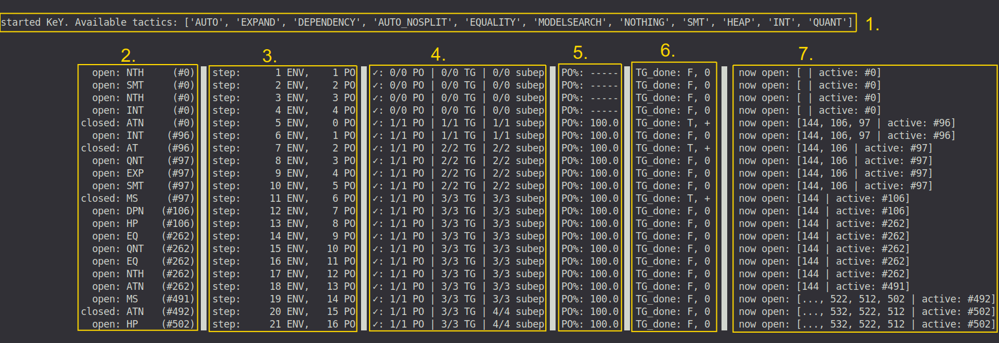

# Automated Program Verification in KeY

This is a custom OpenAI gym environment for automated rule-based deductive program verification in the KeY verification system.

See  for a detailed explanation of what this is all about.

# Installation

The procedure has been tested with python 3.8.


1. Install the gym environment (optionally within your venv or conda env)
```
git clone git@github.com:Flunzmas/gym-autokey.git
cd gym-autokey
pip install -e .
```

2. Install the included version of KeY and prepare the corresponding proof files.
```
cd key/key/
./gradlew :key.ui:installDist
rm -r key.ui/examples/
cp -r ../../autokey_examples/ key.ui/examples/
```

3. Optional: install the Z3 SMT solver and add its bin directory to your PATH (If this is skipped, applying the "SMT" tactic to a goal has no effect just like the "NOTHING" tactic).

# Training / Running The Env

While the env is run, it generates episodes by randomly sampling a new PO from its given set of PO files. The actor then applies tactics that change the proof state, eventually closing the proof tree or reaching time/proof size limits (resulting in a failure). To test the env, you can run `test_env.py`. This script starts KeY and simulates 1000 steps inside the env, randomly selecting tactics. 



The screenshot above shows the console render output of the env during training:

1. shows the available tactics for this run which are fetched from KeY after the startup.
2. shows the applied tactics in each step, the id of the target goal and what happened to the goal after that application.
3. shows the number of env steps so far and the number of steps taken for the current PO.
4. shows the total number of all POs, topgoals and subepisodes encountered so far, and how many of them were closed successfully.
5. shows the running average of successfully closed POs for the last 1000 POs.
6. shows whether reward was given to the actor (T or F, reward is positive (+) for closed topgoals and negative (-) for failures on topgoals).
7. shows the IDs of goals open in the following step. 

# Testing/Evaluation

In order to evaluate a trained tactic selection model, the given fork of KeY includes an _AIServerMacro_ that prompts KeY to query for the next tactic to apply instead of using its own auto mode. By starting a dedicated _TacticServer_ (defined in `tactic_server.py`) that accepts messages containing goal ASTs and that responds with a tactic command, you provide KeY with the tactics that lead it to a proof for given PO.

The _TacticSelector_ defined in `tactic_selector.py` provides a class wrapper including the function `predict()`. This function is called by the _TacticServer_ and is given an observation, by default returning a random tactic. However, by inputting your code for accessing your model you can use the model to return predictions to KeY.

1. Edit `tactic_selector.py` and fill in the TODO-ed sections to use your learned model for the predictions. If you want to use a random selector, just leave the file as-is.

2. Start the tactic server by executing `tactic_server.py`. It creates the _TacticSelector_ that loads your trained model and uses it to predict tactics given the forwarded goal ASTs (Communication between tactic server and KeY is realized using a socket connection on port 6767, see `gym-autokey/envs/config.py`).

3. Evaluate your model, optionally pitting it against KeY's built-in auto mode, by executing `evaluate.py <po_file>`. Replace `<po_file>` with the name of any of the PO files (see `data/po_files/name_explanation.md` for an explanation of what the different po files offer). While a performance overview is printed to the terminal, the TacticSelector saves a tactic selection history as a .txt file to your log folder.
