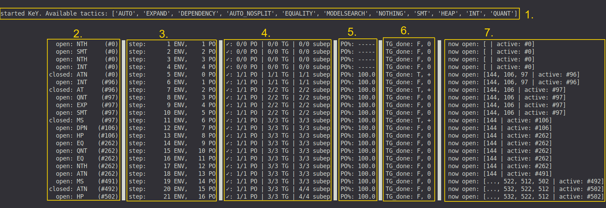

# Automated Program Verification in KeY

This is a custom OpenAI gym environment for automated rule-based deductive program verification in the KeY verification system.

See  for a detailed explanation of what this is all about.

For more information about KeY (and formal verification in general) you can visit the official webpage of [The KeY Project](https://www.key-project.org/).

## OpenAI Env Attributes

| Attribute         | Value                    | Notes                                                      |
|-------------------|--------------------------|------------------------------------------------------------|
| Action Space      | Discrete(num_tactics)    | Tactics are made available by KeY at training start        |
| Observation Space | Custom                   | _See below_                                                |
| Rewards           | {-1, 0, 1}               | -1 = PO failed, 1 = PO closed, 0 otherwise                 |
| Render Modes      | 'human'                  | In-terminal display                                        |

The observation space can be adjusted by changing the value of the config file's `FEATURE_MODE` attribute, yielding of the following:
* A Box-Like vector of hand-picked features, with values ranging from -1 to 1.
* An instance of a DGLGraph (see [the DGL library](https://docs.dgl.ai/index.html)).
* A string representation of the AST, either containing both the operator classes and names or just their names.

# Installation

The procedure has been tested with python 3.8.


1. Install the gym environment (optionally within your venv or conda env)
```
git clone git@github.com:Flunzmas/gym-autokey.git
cd gym-autokey
pip install -e .
```

2. Install the included version of KeY and prepare the corresponding proof files.
```
cd key/key/
./gradlew :key.ui:installDist
rm -r key.ui/examples/
cp -r ../../autokey_examples/ key.ui/examples/
```

3. Optional: install the Z3 SMT solver and add its bin directory to your PATH (If this is skipped, applying the "SMT" tactic to a goal has no effect just like the "NOTHING" tactic).

# Training / Running The Env

While the env is run, it generates episodes by randomly sampling a new PO from its given set of PO files. The actor then applies tactics that change the proof state, eventually closing the proof tree or reaching time/proof size limits (resulting in a failure). To test the env, you can run `scripts/test_env.py`. This script starts KeY and simulates 1000 steps inside the env, randomly selecting tactics. 



The screenshot above shows the console render output of the env during training:

1. shows the available tactics for this run which are fetched from KeY after the startup.
2. shows the applied tactics in each step, the id of the target goal and what happened to the goal after that application.
3. shows the number of env steps so far and the number of steps taken for the current PO.
4. shows the total number of all POs, topgoals and subepisodes encountered so far, and how many of them were closed successfully.
5. shows the running average of successfully closed POs for the last 1000 POs.
6. shows whether reward was given to the actor (T or F, reward is positive (+) for closed topgoals and negative (-) for failures on topgoals).
7. shows the IDs of goals open in the following step.

__Important__: Since KeY is quite a resource-demanding program, the learning process is __single threaded only__.

## Tweaking env parameters

Many parameters and settings of the env are defined in `gym_autokey/envs/config.py`.

The following can be edited to fit your learning/evaluation procedure:

| Variable       | Type           | Explanation                                                                |
|----------------|----------------|----------------------------------------------------------------------------|
| NO_SMT         | bool           | if set to True, the SMT tactic is disregarded.                             |
| FEATURE_MODE   | str            | determines which features to use (e.g. manual or graph features)           |
| TRAIN_PO_FILES | str (filepath) | the relative path to the PO file the env is sampling from during training. |
| TEST_PO_FILES  | str (filepath) | the relative path to the default PO file used for evaluation.              |

While not necessary, these variables can be changed to customise the env for your experiments:

| Variable                 | Type  | Explanation                                                                         |
|--------------------------|-------|-------------------------------------------------------------------------------------|
| KEY_TACTIC_TIME_LIMIT    | int   | maximum time in seconds KeY is given to execute a tactic before being reset.        |
| ROOT_EPIS_MAX_DEPTH      | int   | the maximum allowed depth of the proving tree.                                      |
| MAX_STEPS_PER_PO         | int   | the maximum number of allowed tactic applications per PO.                           |
| PRE_KILL_FAILED_EPISODES | bool  | if set to True, the whole PO proof is instantly aborted on failure of a subepisode. |
| PENALTY_* / REWARD_*     | float | figures for reward and penalty.                                                     |

## Preparing training and test data

I recommend splitting the available PO data into a training set and a test set. Running `scripts/generate_po_files.py` does just that, employing a 70/30% split (you can change that ratio in the script). Then, adjust the variables `TRAIN_PO_FILES` and `TEST_PO_FILES` in `gym_autokey/envs/config.py` to use the generated files.

# Testing/Evaluation

In order to evaluate a trained tactic selection model, the given fork of KeY includes an _AIServerMacro_ that prompts KeY to query for the next tactic to apply instead of using its own auto mode. By starting a dedicated _TacticServer_ (defined in `scripts/tactic_server.py`) that accepts messages containing goal ASTs and that responds with a tactic command, you provide KeY with the tactics that lead it to a proof for given PO.

The _TacticSelector_ defined in `scripts/tactic_selector.py` provides a class wrapper including the function `predict()`. This function is called by the _TacticServer_ and is given an observation, by default returning a random tactic. However, by inputting your code for accessing your model you can use the model to return predictions to KeY.

1. Edit `scripts/tactic_selector.py` and fill in the TODO-ed sections to use your learned model for the predictions. If you want to use a random selector, just leave the file as-is.

2. Start the tactic server by executing `scripts/tactic_server.py`. It creates the _TacticSelector_ that loads your trained model and uses it to predict tactics given the forwarded goal ASTs (Communication between tactic server and KeY is realized using a socket connection on port 6767, see `gym-autokey/envs/config.py`).

3. Evaluate your model, optionally pitting it against KeY's built-in auto mode, by executing `scripts/evaluate.py <po_file>`. Replace `<po_file>` with the name of any of the PO files (see `data/po_files/name_explanation.md` for an explanation of what the different po files offer), including the ones you created earlier by splitting the available data into a training and a test set. A performance overview is printed to the terminal.

## PPO-GoalRGCN

I have implemented a PPO agent that uses a relational GCN (see [the DGL library](https://docs.dgl.ai/index.html)). See `agents/goal_rgcn_agent.py` for the code.
It is able to train on simple training sets, although it needs **a lot** of RAM (>= 16GB for small Graphs). Future work might tackle this issue or test the performance on bigger machines than the ones I have access to.

# Attribution

Here's a bibtex snippet if the repo is valuable enough to be cited.

```
@misc{gym_autokey,
  author = {Boltres, Andreas and Ulbrich, Mattias and Beckert, Bernhard},
  title = {An OpenAI Gym Environment for Automated Rule-Based Deductive Program Verification in KeY.},
  year = {2020},
  publisher = {GitHub},
  journal = {GitHub repository},
  howpublished = {\url{https://github.com/Flunzmas/gym-autokey}},
}
```

The second ([mattulbrich](https://github.com/mattulbrich)) and third author ([bbeckert](https://github.com/bbeckert)), although not directly involved in this repository, have contributed significantly to the development of this project.
